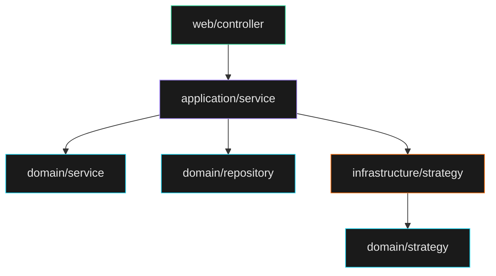
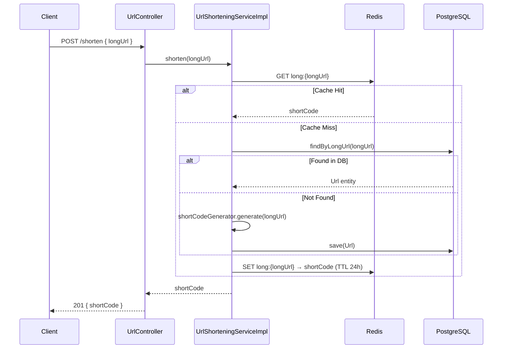
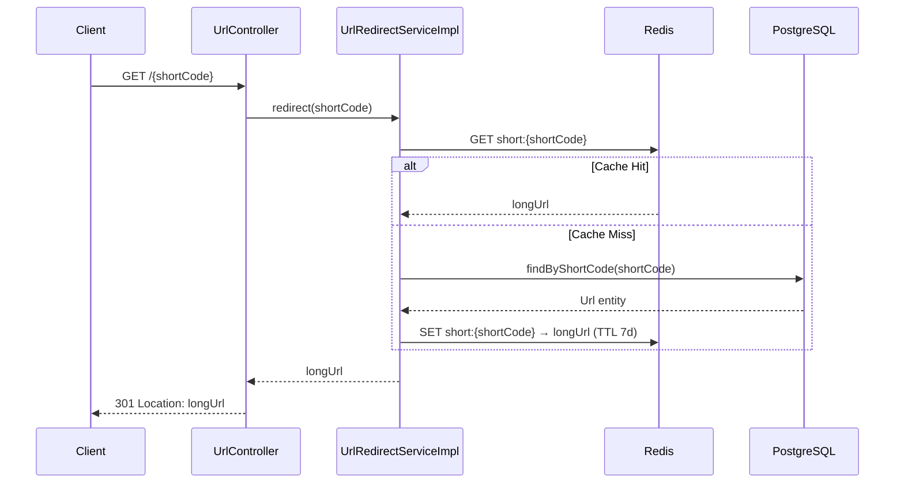
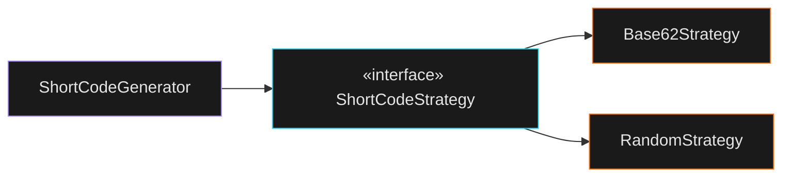

# Shortr

A fast, no-nonsense URL shortener built with **Spring Boot 4**, **Java 25**, **PostgreSQL**, and **Redis**.

## Tech Stack

| Layer         | Technology                           |
|---------------|--------------------------------------|
| Runtime       | Java 25                              |
| Framework     | Spring Boot 4.0.3 (Web MVC)         |
| Database      | PostgreSQL 17                        |
| Cache         | Redis 7                              |
| Templates     | Thymeleaf                            |
| Validation    | Jakarta Bean Validation              |
| Build         | Maven                                |
| Testing       | JUnit 5 + Testcontainers            |
| Dev tools     | Lombok, Spring Boot DevTools         |

## Architecture

The project follows a **layered DDD** structure with clear separation of concerns:

```
com.almirdev.shortr
├── domain/              # Pure business rules — no framework imports
│   ├── model/           # Url entity
│   ├── repository/      # UrlRepository interface (port)
│   ├── service/         # UrlShorteningService, UrlRedirectService (ports)
│   ├── strategy/        # ShortCodeStrategy interface (port)
│   └── exception/       # UrlNotFoundException
├── application/         # Use-case orchestration
│   ├── service/         # UrlShorteningServiceImpl, UrlRedirectServiceImpl
│   └── dto/             # ShortenRequest, ShortenResponse
├── infrastructure/      # Framework adapters
│   └── strategy/        # Base62Strategy, RandomStrategy, ShortCodeGenerator
└── web/                 # HTTP layer
    ├── controller/      # UrlController, IndexController
    └── exception/       # GlobalExceptionHandler
```

### Layer Dependency Diagram



## How It Works

### URL Shortening — `POST /shorten`



### URL Redirect — `GET /{shortCode}`



## Short Code Generation

The strategy is selected at startup via the `shortr.strategy` property using `@ConditionalOnProperty`:



| Strategy   | Config value         | How it works                                    |
|------------|----------------------|-------------------------------------------------|
| **Base62** | `shortr.strategy=base62` (default) | MD5 hash → first 8 bytes → Base62 encoding |
| **Random** | `shortr.strategy=random`           | 8 random chars from `[0-9a-zA-Z]`          |

## Caching Strategy

| Cache Key             | Direction            | TTL  |
|-----------------------|----------------------|------|
| `long:{longUrl}`      | longUrl → shortCode  | 24h  |
| `short:{shortCode}`   | shortCode → longUrl  | 7d   |

## Data Model

| Column         | Type        | Constraints                 |
|----------------|-------------|-----------------------------|
| `id`           | `BIGSERIAL` | PK, auto-increment         |
| `short_code`   | `VARCHAR(20)` | Unique, indexed           |
| `long_url`     | `TEXT`      | Not null, indexed           |
| `created_at`   | `TIMESTAMP` | Not null, auto-generated    |

## Getting Started

### Prerequisites

- Java 25+
- Docker & Docker Compose

### Run

```bash
# Start PostgreSQL and Redis
docker compose up -d

# Start the application
./mvnw spring-boot:run
```

Open [http://localhost:8080](http://localhost:8080).

### Test

Integration tests use **Testcontainers** — Docker must be running:

```bash
./mvnw test
```

## License

MIT
