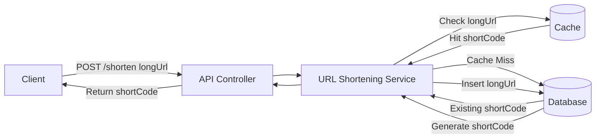
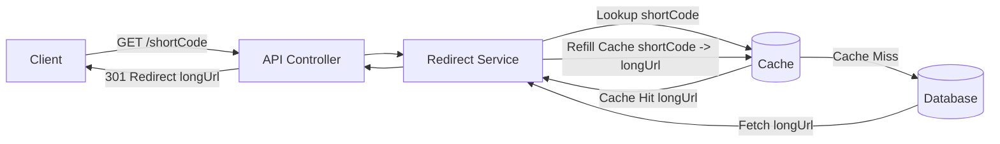

# 1. Problem Statement

- What problem are we solving?
	- Long URLs can be a problem to users. Shortr comes to solve this and serve as a library for store this to users.
- Who are the users?
	- Any user that wants to shorten the URLs
- What are the main use cases?
	- Users can create short URLs that redirect to long URLs.

---

# 2. Functional Requirements

- Users can create short URLs
- Redirect short URLs to Long URLs

---

# 3. Non-Functional Requirements

- Faster redirects (< 100 ms);
- Reliability
- Scalability (10k requests per second)

---

# 4. Capacity Estimation
- How many users?
	- 10M
- Daily URLs created?
	- 1M
- Redirect requests
	- 100M/day
- 1 URL ≈ 500 bytes

---

# 5. High Level Architecture

Short URL Creation:

Redirect:


---

# 6. Data Model
Table: URLs

| Field        | Type      |
| ------------ | --------- |
| id           | long      |
| short_code   | string    |
| original_url | string    |
| created_at   | timestamp |

---

# 7. API Design

Define main endpoints.

Example

`POST /shorten`

Request
```json
{
"longUrl": "https://example.com"
}
```

Response
```json
{
"shortCode": "abc123"
}
```

`GET /{short_code}`
Redirect to original URL. Respond with 301 (Moved Permanently).

---

# 8. Data Storage
- Primary Database: PostgreSQL
- Cache: Redis

Why?
Simple to setup and use.

---

# 9. Caching Strategy

Cache key (on redirect) / hot path
shortCode → longUrl
TTL: 7d

Cache key (on create)
longUrl → shortCode
TTL: 24h